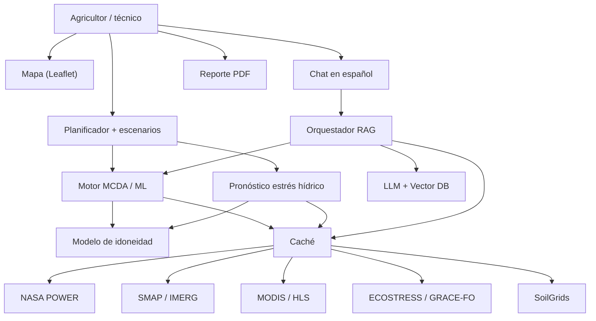

# Estrategia: Field Shift, adaptando fincas con datos de la NASA

> Fuente: documento de trabajo del equipo ([artifact original](https://claude.ai/artifact/Gp4SbuYAXWn8y6Xzxg7PNK), 2026-09-22).
> Objetivo: que la data de la NASA no solo se "use", sino que **sea el motor** de una decisión agrícola real y demostrable.

## 1. Qué nos piden

El reto pide una herramienta que ayude a las comunidades agrícolas a **dejar el monocultivo continuo** y a diseñar **rotaciones de cultivo resilientes al clima** con observación de la Tierra de la NASA. El agricultor debe poder aprovechar esos datos **sin volverse científico de datos**.

Los ejes que el reto espera que simulemos o resolvamos:
- **Conservación de agua:** ahorro de riego frente al agotamiento de acuíferos (humedad del suelo).
- **Reposición biológica de nitrógeno:** fijación natural con leguminosas (+kg N/ha).
- **Ruptura de ciclos de plagas y patógenos:** diversificar familias de plantas.
- **Resiliencia a calor extremo y sequía:** LST e indicadores de estrés.

**Lo que construimos:** un sistema de soporte a la decisión que, dada una finca, recomiende una secuencia de 2–3 temporadas optimizada con datos NASA y muestre el "por qué" en números.

## 2. Cómo se gana

Hay 5 criterios: **Impact, Creativity, Validity, Relevance, Presentation**. Presentation multiplica a los demás: si el juez no entiende el proyecto, no puede puntuar el resto. El código debe ser **open source** y el video pesa mucho (los jueces no tienen que ver más allá del segundo 30).

| Criterio | Qué mira el juez | Cómo lo ganamos |
|---|---|---|
| Relevance | ¿La data NASA es integral y no decorativa? | Mostrar los valores reales de píxel o serie que disparan cada recomendación |
| Validity | ¿Es científicamente correcto? | Umbrales agronómicos reales (GDD, pH, agua) y la fuente de cada dato citada |
| Impact | ¿Resuelve un problema grande? | Cuantificar el agua ahorrada y el N añadido, y ligarlo a la seguridad alimentaria local |
| Creativity | ¿Es novedoso? | Recomendador + simulador de escenarios + asistente en español |
| Presentation | ¿Se entiende en 30 s? | Agricultor → problema → dato NASA → decisión → resultado |

**Regla de oro:** que el demo muestre el número satelital cambiando la decisión. Ejemplo: "SMAP dice humedad 0.12 → por eso NO recomendamos maíz esta temporada".

## 3. Datasets priorizados

Ver el estado verificado en [datos/inventario.md](datos/inventario.md). Orden de prioridad: **NASA POWER → SMAP → GPM IMERG**, luego MODIS, Landsat/HLS, ECOSTRESS y GRACE-FO, más SoilGrids para el suelo. Priorizamos las fuentes con cobertura global (OpenET y Crop-CASMA solo cubren EE. UU.).

Atajo: usar Google Earth Engine para SMAP, MODIS, Landsat, IMERG y ECOSTRESS, y la API directa de POWER. Pre-descargar la zona de la demo.

## 4. Ideas de solución con IA (rankeadas)

1. **Motor de rotación resiliente (el núcleo).** Toma humedad del suelo, LST, lluvia, ET y textura, y recomienda 2–3 cultivos. Técnica: filtros agronómicos duros más un puntaje 0–100 (MCDA), opcionalmente con XGBoost o Random Forest. Explicable.
2. **Simulador de escenarios (el efecto sorpresa del demo).** Controles de lluvia (−40 % a +20 %) y calentamiento (0 a +4 °C) que recalculan en vivo.
3. **Asistente agronómico en español (RAG).** Un LLM con documentos agronómicos y los valores NASA de la finca como contexto.
4. **Alerta temprana de estrés hídrico.** Pronóstico sobre series de SMAP, IMERG y ECOSTRESS (Prophet, LSTM o XGBoost).
5. **Detección de monocultivo por parcela.** Clasificación sobre Landsat/HLS.

**Combinación elegida: 1 + 2 + 3**, aterrizada en Colombia.

## 5. Arquitectura

**Stack sugerido:**
- **Frontend:** Next.js, React, Tailwind, Leaflet y Recharts, desplegado en Vercel.
- **Backend:** FastAPI (Python), desplegado en Render, Railway o HF Spaces.
- **Datos:** `earthaccess`, `earthengine-api`/`geemap` y `requests`.
- **IA:** reglas MCDA o `xgboost`; `prophet`; `chromadb`/`faiss` para el RAG.
- **Base de datos:** opcional (PostGIS); para el hackathon basta un JSON de fincas demo.

**Lógica del motor:**
1. **Filtros duros:** GDD mínimo, pH, agua crítica en secano, calor extremo y no repetir familia botánica.
2. **Puntaje por criterio**, normalizado a [0, 1].
3. **Puntaje global:** `w_clima·clima + w_agua·agua + w_suelo·suelo + w_div·diversidad`, expresado de 0 a 100 con un grado (A+/A/B).

## 6. Diferenciador local: Huila, Colombia

- Monocultivo de **café** y **arroz** en el valle del Magdalena, alta sensibilidad a El Niño y La Niña, y estrés hídrico creciente.
- Rotación: arroz ↔ leguminosas (fríjol, soya); diversificar con cacao, plátano y maíz.
- Asistente en español para pequeños productores.
- Citar **NASA Harvest** y **NASA Acres** como respaldo del enfoque.

## 7. Trampas a evitar

- Usar la data NASA como decoración.
- Dejar la presentación para el final.
- Prometer una IA que no corre: la validez pesa más que el hype.
- Depender de descargas en vivo durante el demo.
- Olvidar al usuario final.
